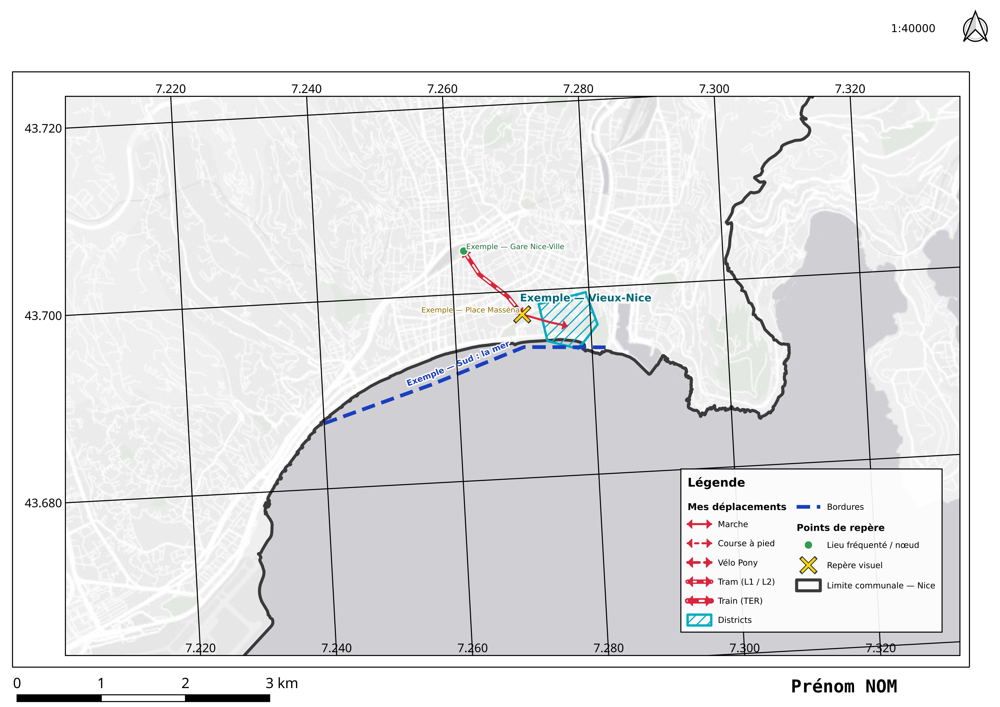

# Nice - carte de mobilité (template QGIS)

Template de projet QGIS pour réaliser sa **carte de perception personnelle de Nice** : districts, bordures, points de repère et déplacements, à la manière de la carte mentale de Kevin Lynch. La symbologie, les étiquettes et les mises en page A4 sont prêtes : il ne reste qu'à dessiner ses propres entités.

## Contenu

| Fichier | Rôle |
|---|---|
| `nice-mobilite-template.qgz` | Projet QGIS (couches, styles, 2 mises en page A4 paysage : 1:55 000 et 1:40 000) |
| `nice-perception.gpkg` | GeoPackage à remplir — couches `districts`, `bordures`, `reperes`, `deplacements` (EPSG:4326), contient quelques entités **« Exemple — … »** à supprimer |
| `nice-limite.geojson` | Limite communale de Nice (© OpenStreetMap / Nominatim) |
| `apercu.png` | Aperçu de la mise en page |

Fonds de carte (flux XYZ, connexion Internet nécessaire) : Esri Light Gray Canvas et OpenStreetMap. Tous les chemins sont relatifs : le projet s'ouvre directement après clonage. Testé avec QGIS 3.40.

## Mode d'emploi

1. **Récupérer le template** : `git clone https://github.com/2h5hhj6kjn-star/nice-mobilite-template.git` ou *Code → Download ZIP*.
2. Ouvrir `nice-mobilite-template.qgz` dans QGIS.
3. **Supprimer les entités d'exemple** (leur nom commence par « Exemple — ») dans les 4 couches, ou les garder le temps de comprendre le rendu.
4. Passer chaque couche en mode édition et dessiner ses entités en renseignant les attributs ci-dessous (la symbologie en dépend).
5. Dans la mise en page (*Projet → Mises en page*), remplacer **« Prénom NOM »** par son nom et ajuster le cadrage si besoin.
6. Exporter en PDF à 300 dpi (*Mise en page → Exporter au format PDF*).

## Attributs à renseigner

### `districts` (polygones) - quartiers / secteurs pratiqués

| Champ | Contenu |
|---|---|
| `nom` | Nom du district (étiquette sur la carte) |
| `description` | Ce que représente ce secteur pour vous |
| `fonction` | ex. `domicile / études`, `courses`, `loisirs`, `transit` |
| `frequence` | ex. `quotidien`, `hebdomadaire`, `bimensuel`, `occasionnel` |
| `lieux` | Lieux marquants du secteur |

### `bordures` (lignes) - limites perçues du territoire

| Champ | Contenu |
|---|---|
| `nom` | Nom de la bordure (étiquette) |
| `type` | `naturelle`, `infrastructure` ou `psychologique` |
| `description` | Pourquoi c'est une limite pour vous |

### `reperes` (points) - points de repère

| Champ | Contenu |
|---|---|
| `nom` | Nom du lieu (étiquette) |
| `categorie` | **`frequente`** (lieu fréquenté / nœud, point vert) ou **`visuel`** (repère visuel, croix jaune) |
| `sous_type` | pour `frequente` : `domicile`, `travail`, `études`, `sport`, `santé`, `courses`, `loisirs`, `arrêt`, `passage` — pour `visuel` : `bâtiment`, `monument`, `site`, `relief`. Les sous-types `domicile`, `travail`, `sport`, `études`, `santé` sont étiquetés en plus gros. |
| `description` | Libre |

### `deplacements` (lignes) - trajets

| Champ | Contenu |
|---|---|
| `trajet` | Nom du trajet complet (ex. `Travail (aller)`) |
| `segment` | Numéro du tronçon dans le trajet (1, 2, 3…) |
| `nom` | Nom du tronçon (ex. `Gare → Masséna`) |
| `origine`, `destination` | Extrémités du tronçon |
| `mode` | Mode précis : `marche`, `course à pied`, `vélo Pony`, `tram L1`, `tram L2`, `train TER`… |
| `mode_groupe` | **Pilote la couleur/le style** : `marche`, `course`, `vélo`, `tram` ou `train` |
| `type` | Motif : `travail`, `études`, `courses`, `sport`, `santé`, `loisirs`… |
| `frequence` | `quotidien`, `3x/semaine`, `hebdomadaire`, `bimensuel`, `occasionnel`, `saisonnier`… |
| `aller_retour` | `oui` → flèche double, `non` → flèche simple (sens unique) |
| `rang` | Décalage du tracé (0, 1, 2…) quand plusieurs trajets partagent le même tronçon : chaque rang décale la ligne de 0,6 mm |
| `longueur_m` | Longueur en mètres (facultatif) |
| `commentaire` | Libre |

## Crédits

Fonds : © OpenStreetMap contributors, © Esri. Limite communale : © OpenStreetMap / Nominatim.
Template réalisé dans le cadre d'un travail universitaire sur la mobilité à Nice.
